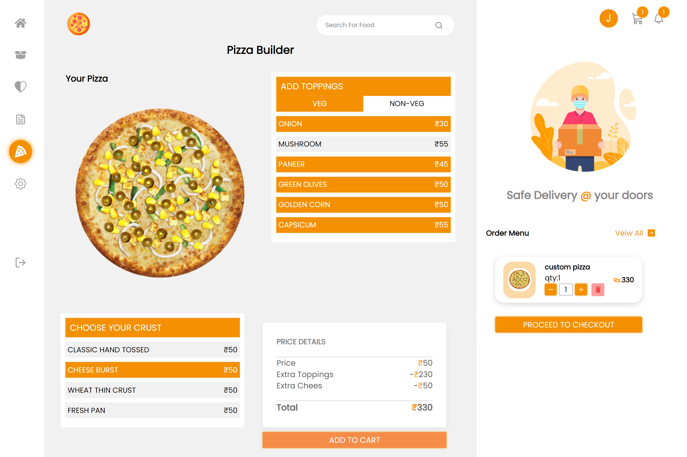

# DineDash - Food Delivery - [(Live App Link)]()

  

 

### Hightlights (Screenshorts Attached ⬇️)
- > Food Delivery app made using MERN stack 
- > APP uses morden React and NodeJS features like Modules ,Skeletons , React Portals ,Redux thunk 
- > Followed MVC architecture and microservices for serever side
- > ***NOTE: This is lighter version of original website, due to NDA signed.***

## 🚀 Tech and Tools Used - MERN ⚒️🔥🔍

- React.JS 
- Redux
- NodeJS
- Express
- MongoDB
- VS Code
- Heruko
- REST APIS
- GoogleAPIs
- Yup

## ⚙️ Features 🚀

- User Authentication by Email
- User can add carts items to the cart
- Users can update quantity & delete the item
- User can check the summary of the order like items price, delivery price and total
- User can select COD or online (Razorpay) payment for the order
- After Placing the order user will redirect to the order details page and receive an email with the order
- Users can view their old orders and profile
- User can add, edit or delete address during checkout

## 📸 Screenshots

## Home Page

## Cart Management

## Address Management

## Profile Management

## Pizza Builder Page

 

#
## Author : Dixit Ghodadara [(Github Profile)](https://github.com/DixitGdev)

## Contributing

We welcome contributions from the community. Whether it's a bug report, new feature, correction, or additional documentation, we greatly appreciate your help. Please ensure your pull request adheres to our contribution guidelines.

## License

This project is licensed under the MIT License. See the LICENSE file for details.

## Contact

If you have any questions, feel free to contact us. We appreciate your feedback!

## Acknowledgements

We would like to thank the open source community for their continuous support and inspiration. We are always learning and improving, thanks to you.
